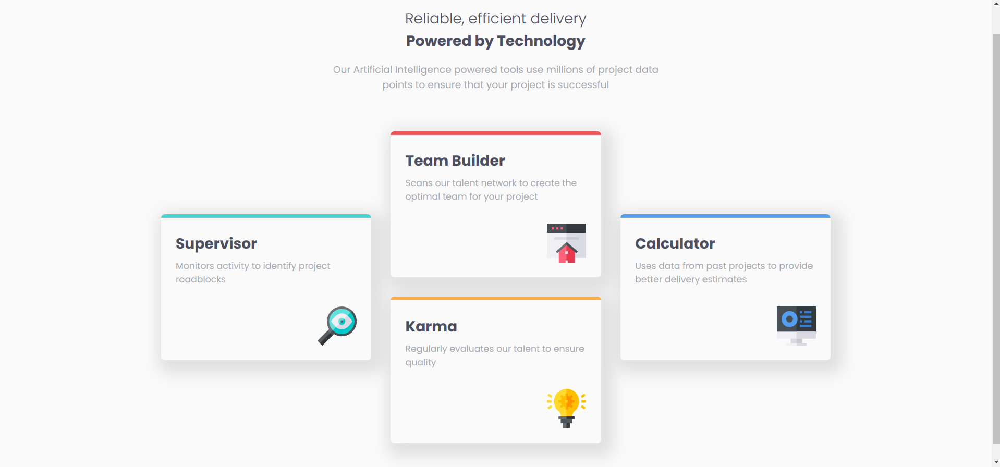
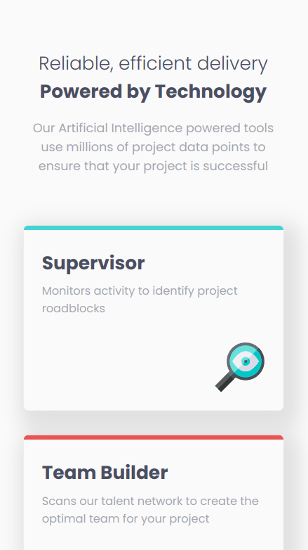

# Frontend Mentor - Four card feature section solution

This is a solution to the [Four card feature section challenge on Frontend Mentor](https://www.frontendmentor.io/challenges/four-card-feature-section-weK1eFYK). Frontend Mentor challenges help you improve your coding skills by building realistic projects. 

## Table of contents

- [Overview](#overview)
  - [The challenge](#the-challenge)
  - [Screenshot](#screenshot)
  - [Links](#links)
- [My process](#my-process)
  - [Built with](#built-with)
  - [What I learned](#what-i-learned)
  - [Continued development](#continued-development)

## Overview

### The challenge

Users should be able to:

- View the optimal layout for the site depending on their device's screen size

### Screenshot

### Links

- Solution URL: [Solution URL here](https://github.com/andrew-j-brown/Four-Card-Feature-Section)
- Live Site URL: [Live site URL here](https://andrew-j-brown.github.io/Four-Card-Feature-Section/)

## My process

### Built with

- HTML5 markup
- CSS custom properties
- Flexbox
- CSS Grid
- Mobile-first workflow
- Sass (scss)

### What I learned

In this project, I got to put my css grid skills to work. I have used them in the past, but was quite rusty before this project. I am happy with how it turned out!

This is my second project using *Sass*, and I quite like it!

### Continued development

I would like to:

- Continue learning how to utilize *Sass* to it's utmost potential
- Work on refining my semantic html
- Work on more consistent and frequent git pushes, rather than pushing a bunch of changes at once